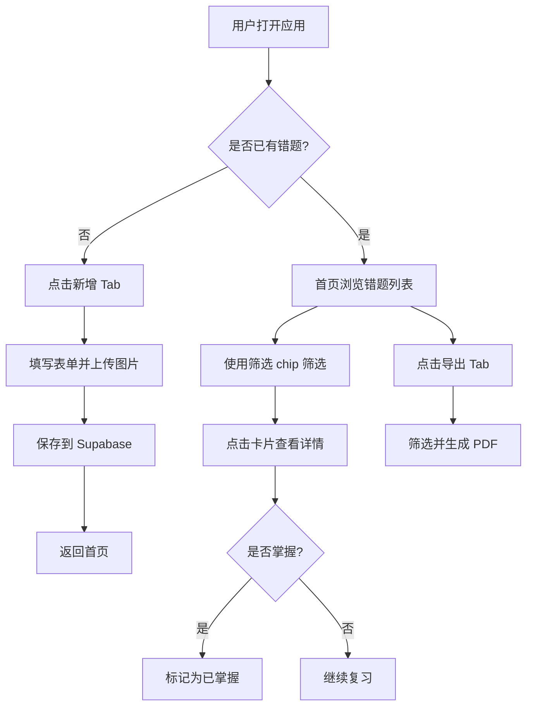

# 考研错题本 Web App 产品需求文档（PRD）

## 1. 产品概述

考研错题本是一款面向考研学生的手机优先 Web 应用，用于记录、整理和复习数学一与专业课的错题。通过拍照上传、分类管理、智能筛选和 PDF 导出，帮助考生高效复盘错题、巩固薄弱知识点，最终提升备考效率。

- **目标用户**：参加考研的学生（数学一 + 专业课）
- **核心价值**：无需登录即开即用，手机拍照即可记录错题，按科目/章节/知识点/难度/错因多维筛选，支持一键导出 PDF 打印复习
- **使用场景**：刷题时随手拍照记录错题；考前按章节/难度筛选导出 PDF 集中复习；日常通勤时按待复习状态浏览回顾

## 2. 核心功能

### 2.1 用户角色

本应用为单人使用，无需登录注册，所有数据存储在用户自己的 Supabase 项目中。

### 2.2 功能模块

1. **首页**：错题统计、多维筛选 chip 栏、题目卡片列表、无限滚动加载
2. **新增错题**：科目/章节/知识点选择、题目与解析图片上传、错因标签、难度评级、来源记录
3. **错题详情**：图片轮播放大、面包屑导航、编辑/删除/掌握状态切换
4. **PDF 导出**：多条件筛选、按章节分组、生成 A4 竖版 PDF 下载
5. **设置**：科目/章节/知识点三级管理、数据统计可视化

### 2.3 页面详情

| 页面名称 | 模块名称 | 功能描述 |
|---------|---------|---------|
| 首页 | 顶部统计栏 | 显示「错题本」标题、总题数、待复习题数 |
| 首页 | 筛选 chip 栏 | 横向滑动，按科目/章节/难度(1-5星)/复习状态/错因类型筛选 |
| 首页 | 题目卡片列表 | 缩略图+科目章节知识点+难度星级+错因标签+状态徽章+录入时间 |
| 首页 | 无限滚动 | 滚动到底部自动加载 20 条 |
| 首页 | 空状态 | 友好提示引导新增错题 |
| 新增错题 | 科目选择 | 大卡片按钮选择科目 |
| 新增错题 | 章节/知识点选择 | 下拉选择 + 支持直接新建 |
| 新增错题 | 题目图片上传 | 必填，最多 5 张，多选相册，压缩到最大边 1200px |
| 新增错题 | 解析图片上传 | 可选，最多 5 张 |
| 新增错题 | 错因标签 | 多选：计算失误/概念模糊/方法不会/粗心大意/时间不够 |
| 新增错题 | 错因描述 | 可选文本框 |
| 新增错题 | 解析补充 | 可选文本框 |
| 新增错题 | 难度评级 | 点击选择 1-5 星 |
| 新增错题 | 题目来源 | 可选文本框（如：2023真题T15） |
| 新增错题 | 保存按钮 | 底部固定，显示上传进度，成功 toast 后返回首页 |
| 错题详情 | 顶部操作栏 | 返回/编辑/删除（二次确认） |
| 错题详情 | 面包屑 | 科目/章节/知识点 |
| 错题详情 | 题目图片轮播 | 点击放大，支持双指缩放 |
| 错题详情 | 解析图片轮播 | 同上 |
| 错题详情 | 信息展示 | 错因标签/描述/解析补充/难度/来源/录入时间 |
| 错题详情 | 底部切换按钮 | 一键切换「已掌握/待复习」 |
| 错题详情 | 原地编辑 | 点编辑后变为编辑表单 |
| PDF 导出 | 筛选条件 | 科目多选/章节多选/复习状态/难度范围 |
| PDF 导出 | 导出选项 | 按章节分组/包含解析 |
| PDF 导出 | 数量预览 | 实时显示符合条件的题目数 |
| PDF 导出 | 生成按钮 | html2canvas + jsPDF 生成 A4 竖版 PDF 下载 |
| 设置 | 科目管理 | 新增/重命名/删除(级联提示)/设置颜色 |
| 设置 | 章节管理 | 选择科目后新增/重命名/排序/删除 |
| 设置 | 知识点管理 | 选择科目+章节后新增/重命名/删除 |
| 设置 | 数据统计 | 各科目题数/待复习/已掌握；错因类型分布 |

## 3. 核心流程

### 3.1 新增错题流程

用户打开应用 → 点击底部「新增」Tab → 选择科目 → 选择/新建章节 → 选择/新建知识点 → 拍照或从相册选择题目图片（自动压缩）→ 可选上传解析图片 → 选择错因标签 → 填写描述/补充/来源 → 评级难度 → 点击保存 → 图片上传到 Storage（显示进度）→ 写入数据库 → Toast 提示成功 → 返回首页

### 3.2 复习筛选流程

用户进入首页 → 横向滑动筛选 chip 栏 → 选择科目/章节/难度/状态/错因 → 列表实时刷新 → 滚动加载更多 → 点击卡片进入详情 → 查看图片与解析 → 点击「标记已掌握」→ 返回列表

### 3.3 PDF 导出流程

用户点击「导出」Tab → 选择科目/章节/状态/难度范围 → 选择是否按章节分组/包含解析 → 查看预览数量 → 点击「生成 PDF」→ html2canvas 渲染题目为图片 → jsPDF 拼接 A4 竖版 → 自动下载

## 4. 用户界面设计

### 4.1 设计风格

- **整体风格**：纸质感、温暖、专注，营造书桌前学习的氛围
- **主背景色**：#EFEEE7（纸质感米白）
- **数学一强调色**：#B8472F（暗红，沉稳学术感）
- **专业课强调色**：#3E7470（暗青，宁静专注感）
- **卡片背景**：#FBFAF6，圆角 12px，轻微阴影
- **按钮风格**：圆角 8-12px，最小点击区域 44×44px，主按钮使用强调色填充
- **字体**：系统字体栈，标题加粗，正文常规
- **图标**：lucide-react 线性图标，与纸质风格协调
- **布局**：手机优先，390px 基准宽度，底部固定导航栏

### 4.2 页面设计概览

| 页面名称 | 模块名称 | UI 元素 |
|---------|---------|---------|
| 首页 | 顶部统计栏 | 标题左对齐，统计数字右对齐，强调色数字 |
| 首页 | 筛选 chip 栏 | 横向滚动，选中态填充强调色，未选中描边 |
| 首页 | 题目卡片 | 左侧缩略图 80×80px，右侧信息，底部标签行 |
| 首页 | 骨架屏 | 灰色卡片占位，animate-pulse 动画 |
| 新增错题 | 表单 | 分组卡片，每组标题+内容，必填项红色星号 |
| 新增错题 | 图片上传 | 网格布局，加号占位，已选显示缩略图+删除角标 |
| 新增错题 | 难度星级 | 5 颗星可点击，选中填充暗红 |
| 新增错题 | 保存按钮 | 底部固定，全宽，强调色，显示进度条 |
| 错题详情 | 轮播 | 横向滑动，圆角，点击全屏遮罩 |
| 错题详情 | 信息卡片 | 分组展示，标签徽章圆角 |
| PDF 导出 | 筛选区 | 折叠分组，多选 chip |
| PDF 导出 | 预览数量 | 强调色大数字 |
| 设置 | 管理列表 | 列表项 + 右侧操作按钮 |
| 设置 | 统计图表 | 横向条形图，强调色填充 |

### 4.3 响应式设计

- **手机优先**：以 390px 屏幕宽度为基准设计
- **平板适配**：最大宽度 480px 居中，两侧留白
- **触摸优化**：所有可点击元素最小 44×44px，间距充足
- **横屏适配**：表单与列表保持竖向滚动，不强制横屏布局

### 4.4 交互细节

- **加载态**：骨架屏占位，避免空白闪烁
- **表单验证**：必填项缺失时红色边框 + 下方提示文字
- **Toast 提示**：成功绿色、失败红色，顶部滑入，3 秒自动消失
- **二次确认**：删除操作弹出居中确认弹窗，遮罩背景
- **图片放大**：点击后全屏黑色遮罩，支持双指缩放与滑动切换
- **无限滚动**：IntersectionObserver 监听底部哨兵元素
