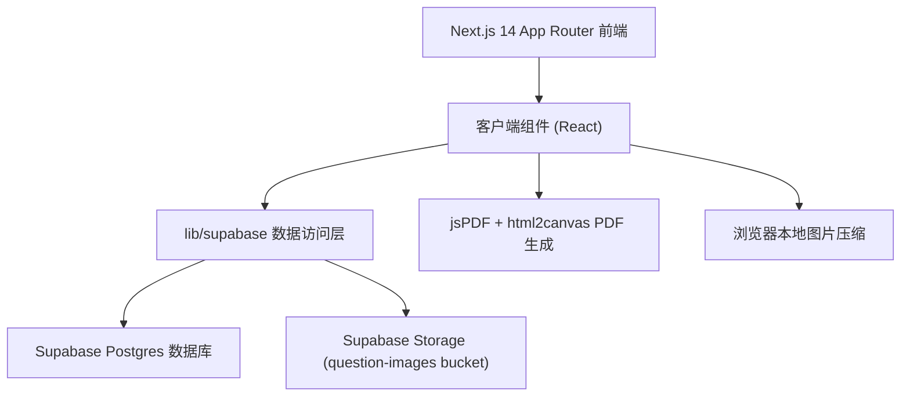
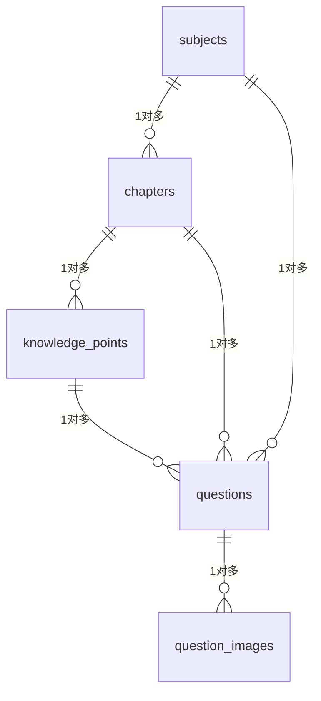

# 考研错题本 Web App 技术架构文档

## 1. 架构设计



应用为纯前端 + BaaS 架构，无自建后端。Next.js 14 App Router 提供页面路由与渲染，所有数据操作通过 `lib/supabase/` 封装层调用 Supabase 客户端 SDK，直接与 Postgres 数据库和 Storage 交互。PDF 生成与图片压缩均在浏览器端完成。

## 2. 技术栈说明

- **前端框架**：Next.js 14（App Router）+ React 18 + TypeScript
- **样式方案**：Tailwind CSS 3（手机优先，390px 基准）
- **BaaS 服务**：Supabase（Postgres 数据库 + Storage 对象存储）
- **PDF 导出**：jsPDF + html2canvas
- **图标库**：lucide-react
- **状态管理**：React Context + SWR（数据获取缓存）
- **初始化工具**：create-next-app（手动指定 Next.js 14）

## 3. 路由定义

| 路由 | 用途 |
|------|------|
| `/` | 首页：错题列表与筛选 |
| `/new` | 新增错题表单 |
| `/export` | PDF 导出页 |
| `/settings` | 设置页（科目/章节/知识点管理 + 统计） |
| `/question/[id]` | 错题详情页 |

底部导航栏在以上四个 Tab 间切换，详情页通过列表卡片点击进入（无底部导航栏）。

## 4. 数据模型

### 4.1 ER 图



### 4.2 表结构定义

```sql
-- 科目表
CREATE TABLE subjects (
  id UUID PRIMARY KEY DEFAULT gen_random_uuid(),
  name TEXT NOT NULL,
  color TEXT NOT NULL DEFAULT '#B8472F',
  sort_order INT NOT NULL DEFAULT 0,
  created_at TIMESTAMPTZ NOT NULL DEFAULT now()
);

-- 章节表
CREATE TABLE chapters (
  id UUID PRIMARY KEY DEFAULT gen_random_uuid(),
  subject_id UUID NOT NULL REFERENCES subjects(id) ON DELETE CASCADE,
  name TEXT NOT NULL,
  sort_order INT NOT NULL DEFAULT 0,
  created_at TIMESTAMPTZ NOT NULL DEFAULT now()
);

-- 知识点表
CREATE TABLE knowledge_points (
  id UUID PRIMARY KEY DEFAULT gen_random_uuid(),
  chapter_id UUID NOT NULL REFERENCES chapters(id) ON DELETE CASCADE,
  name TEXT NOT NULL,
  created_at TIMESTAMPTZ NOT NULL DEFAULT now()
);

-- 错题表
CREATE TABLE questions (
  id UUID PRIMARY KEY DEFAULT gen_random_uuid(),
  subject_id UUID NOT NULL REFERENCES subjects(id) ON DELETE CASCADE,
  chapter_id UUID NOT NULL REFERENCES chapters(id) ON DELETE CASCADE,
  knowledge_point_id UUID REFERENCES knowledge_points(id) ON DELETE SET NULL,
  difficulty INT NOT NULL DEFAULT 3 CHECK (difficulty BETWEEN 1 AND 5),
  error_tags TEXT[] NOT NULL DEFAULT '{}',
  error_description TEXT,
  analysis_supplement TEXT,
  source TEXT,
  review_status TEXT NOT NULL DEFAULT 'pending' CHECK (review_status IN ('pending', 'mastered')),
  created_at TIMESTAMPTZ NOT NULL DEFAULT now(),
  updated_at TIMESTAMPTZ NOT NULL DEFAULT now()
);

-- 题目图片表
CREATE TABLE question_images (
  id UUID PRIMARY KEY DEFAULT gen_random_uuid(),
  question_id UUID NOT NULL REFERENCES questions(id) ON DELETE CASCADE,
  type TEXT NOT NULL CHECK (type IN ('question', 'analysis')),
  storage_path TEXT NOT NULL,
  sort_order INT NOT NULL DEFAULT 0,
  created_at TIMESTAMPTZ NOT NULL DEFAULT now()
);

-- 索引
CREATE INDEX idx_chapters_subject ON chapters(subject_id);
CREATE INDEX idx_knowledge_points_chapter ON knowledge_points(chapter_id);
CREATE INDEX idx_questions_subject ON questions(subject_id);
CREATE INDEX idx_questions_chapter ON questions(chapter_id);
CREATE INDEX idx_questions_knowledge_point ON questions(knowledge_point_id);
CREATE INDEX idx_questions_review_status ON questions(review_status);
CREATE INDEX idx_questions_created_at ON questions(created_at DESC);
CREATE INDEX idx_question_images_question ON question_images(question_id);
```

### 4.3 Storage 策略

- **Bucket 名称**：`question-images`（public）
- **上传路径格式**：`{question_id}/{type}/{timestamp}.jpg`
  - `type` 取值：`question` 或 `analysis`
  - `timestamp` 为毫秒级时间戳
- **公开读取**：通过 `https://{project}.supabase.co/storage/v1/object/public/question-images/{path}` 访问

## 5. 代码结构

```
cuoti/
├── app/                          # Next.js App Router
│   ├── layout.tsx               # 根布局
│   ├── page.tsx                  # 首页
│   ├── new/
│   │   └── page.tsx              # 新增错题
│   ├── export/
│   │   └── page.tsx              # PDF 导出
│   ├── settings/
│   │   └── page.tsx              # 设置
│   └── question/
│       └── [id]/
│           └── page.tsx          # 错题详情
├── components/
│   ├── layout/
│   │   ├── BottomNav.tsx         # 底部导航栏
│   │   └── PageHeader.tsx        # 页面头部
│   ├── home/
│   │   ├── StatsBar.tsx           # 顶部统计
│   │   ├── FilterChips.tsx        # 筛选 chip 栏
│   │   ├── QuestionCard.tsx       # 题目卡片
│   │   └── QuestionListSkeleton.tsx
│   ├── new/
│   │   ├── SubjectPicker.tsx
│   │   ├── ChapterKnowledgePicker.tsx
│   │   ├── ImageUploader.tsx
│   │   ├── ErrorTagSelector.tsx
│   │   └── DifficultyPicker.tsx
│   ├── detail/
│   │   ├── ImageCarousel.tsx
│   │   ├── ImageViewer.tsx        # 全屏查看
│   │   ├── QuestionInfo.tsx
│   │   └── EditForm.tsx
│   ├── export/
│   │   ├── ExportFilters.tsx
│   │   └── PdfPreview.tsx
│   ├── settings/
│   │   ├── SubjectManager.tsx
│   │   ├── ChapterManager.tsx
│   │   ├── KnowledgePointManager.tsx
│   │   └── DataStats.tsx
│   └── ui/
│       ├── Toast.tsx
│       ├── Modal.tsx
│       ├── Skeleton.tsx
│       ├── StarRating.tsx
│       └── EmptyState.tsx
├── lib/
│   ├── supabase/
│   │   ├── client.ts              # 客户端实例
│   │   ├── subjects.ts            # 科目 CRUD
│   │   ├── chapters.ts            # 章节 CRUD
│   │   ├── knowledge-points.ts    # 知识点 CRUD
│   │   ├── questions.ts           # 错题查询/新增/编辑/删除
│   │   ├── images.ts              # 图片上传/删除
│   │   └── stats.ts               # 数据统计
│   ├── pdf/
│   │   └── generate-pdf.ts        # PDF 生成逻辑
│   ├── image/
│   │   └── compress.ts            # 图片压缩
│   └── utils/
│       ├── format.ts              # 日期/文本格式化
│       └── cn.ts                  # className 合并
├── types/
│   └── index.ts                   # 全局类型定义
├── hooks/
│   ├── useToast.ts                # Toast 状态
│   ├── useInfiniteScroll.ts       # 无限滚动
│   └── useQuestions.ts            # 错题数据获取
├── store/
│   └── toast.ts                   # zustand toast store
├── public/
├── tailwind.config.ts
├── next.config.js
├── tsconfig.json
└── package.json
```

## 6. Supabase 客户端配置

环境变量（用户稍后填入）：

```bash
NEXT_PUBLIC_SUPABASE_URL=your-project-url
NEXT_PUBLIC_SUPABASE_ANON_KEY=your-anon-key
```

客户端实例在 `lib/supabase/client.ts` 中创建单例，所有数据访问层模块复用该实例。

## 7. 关键技术实现

### 7.1 图片压缩

使用 Canvas API 在上传前将图片压缩到最大边 1200px，输出 JPEG 格式：

```typescript
export async function compressImage(file: File, maxSize = 1200): Promise<File> {
  // 读取图片 → 计算缩放比例 → 绘制到 Canvas → toBlob 输出
}
```

### 7.2 无限滚动

使用 IntersectionObserver 监听列表底部哨兵元素，触发时加载下一页 20 条：

```typescript
export function useInfiniteScroll(callback: () => void) {
  // IntersectionObserver + 防抖
}
```

### 7.3 PDF 生成

1. 构建隐藏的 HTML 渲染容器，按章节分组排列题目
2. html2canvas 将每道题渲染为 Canvas
3. jsPDF 创建 A4 竖版文档，按比例分页拼接图片
4. 自动触发下载

### 7.4 图片轮播与缩放

- 横向滑动使用 CSS scroll-snap
- 全屏查看使用固定定位遮罩 + 双指缩放（touch 事件 + transform scale）
